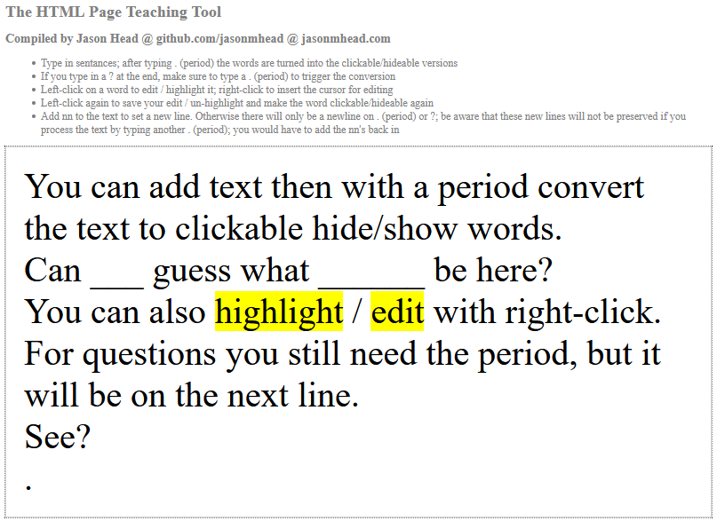

# The-HTML-Page-Teaching-Tool
A click word to hide html page teaching tool

Compiled by Jason Head @ github.com/jasonmhead @ jasonmhead.com

- Type in sentences; after typing . (period) the words are turned into the clickable/hideable versions
- If you type in a ? at the end, make sure to type a . (period) to trigger the conversion
- Right-click on a word to edit / highlight it; right-click to insert the cursor for editing
- Right-click again to save your edit / un-highlight and make the word clickable/hideable again
- Add nn to the text to set a new line. Otherwise there will only be a newline on . (period) or ?; 
be aware that these new lines will not be preserved if you process the text by typing another . (period); 
you would have to add the nn's back in

--------------------------------------------

